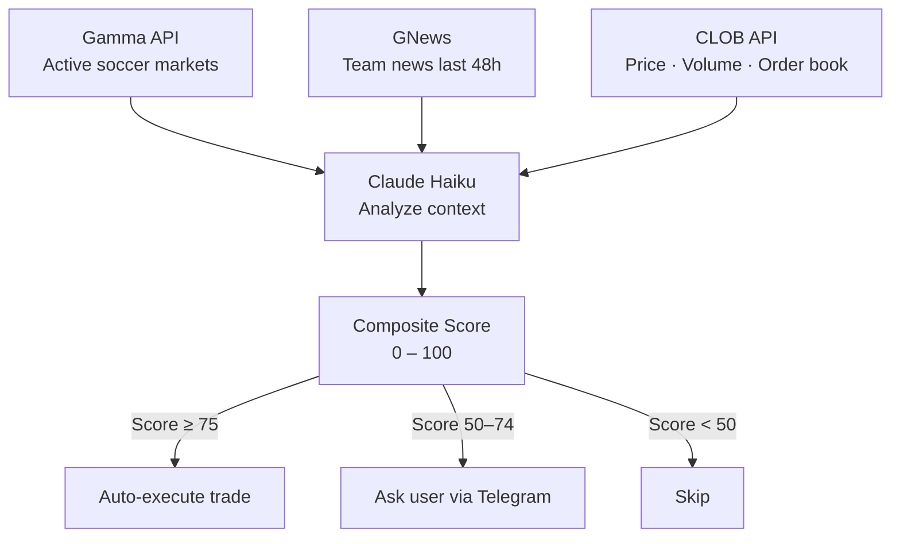
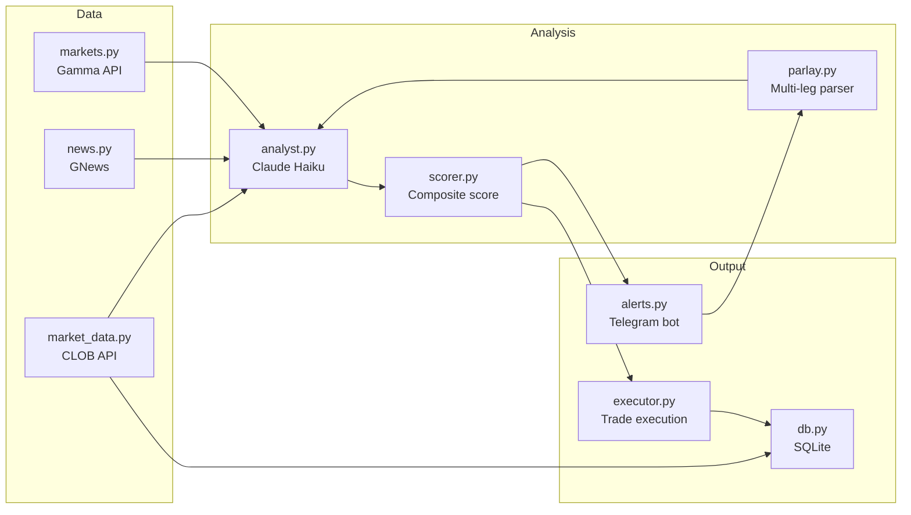

# Haaland

> A semi-autonomous trading agent for soccer prediction markets on Polymarket.

Haaland monitors active soccer markets, reads the latest team news, analyzes price momentum and order flow, and uses Claude to determine whether the market is mispriced. When it finds real edge, it either executes a trade automatically or asks you for confirmation via Telegram.

---

## Why this exists

Polymarket soccer markets move fast and are hard to track manually. By the time you read about an injury or a lineup change, the price has already moved. Haaland closes that gap by running continuously, processing news and market data together, and surfacing only the opportunities where the numbers actually make sense.

---

## How it works



The composite score combines four signals:

| Signal | Weight |
|---|---|
| LLM edge — estimated probability vs market price | 40 pts |
| Price momentum — 1h / 24h trend confirms the signal | 20 pts |
| Liquidity — tight spread means the price is trustworthy | 20 pts |
| Smart money — whale orders (> $500) in the order book | 20 pts |

Markets with a bid/ask spread above 10% are automatically skipped regardless of score.

---

## Telegram interface

The bot works in both private chats and group chats. Anyone in a group can ask for signals and analysis. Trade execution is restricted to your private `chat_id`.

| Command | What it does |
|---|---|
| `/start` | Status and introduction |
| `/markets` | Lists active soccer markets right now |
| `/signal [team]` | Full analysis and BUY / SELL / SKIP signal for a match |
| `/score [team]` | Composite score 0–100 with a breakdown of each signal |
| `/whales` | Large orders detected in the last 24h |
| `/summary` | Daily P&L and executed trades |
| `/analyze [query]` | Natural language parlay or single-event analysis |

### Parlay analysis

`/analyze` understands free-text queries and handles multi-leg parlays:

```
/analyze Will Spain win the World Cup AND Mbappé scores in the final?
```

```
Parlay Analysis

① Spain wins World Cup
   Market price:     42%
   Agent estimate:   51%
   Edge:            +9% → slight BUY

② Mbappé scores in the final
   Market price:     38%
   Agent estimate:   29%
   Edge:            -9% → SKIP

─────────────────────
 Combined probability
   Market implied:   15.9%
   Agent estimate:   14.8%

 Final verdict: SKIP
   Leg 2 is slightly overpriced. Better to play Leg 1 alone.
```

Each leg is analyzed independently using the same engine, then combined into a final verdict.

---

## Architecture



### Module breakdown

| File | Responsibility |
|---|---|
| `main.py` | Main loop — runs the full pipeline every X minutes |
| `markets.py` | Fetches active soccer markets from Gamma API |
| `news.py` | Pulls last 48h of team news from GNews |
| `market_data.py` | Gets price, volume, spread, and order book from CLOB API |
| `analyst.py` | Sends context to Claude Haiku, returns structured signal |
| `scorer.py` | Combines LLM edge, momentum, liquidity, and smart money into 0–100 |
| `parlay.py` | Parses free-text queries, runs analyst per leg, combines probabilities |
| `executor.py` | Executes trades via `py-clob-client` |
| `alerts.py` | Telegram bot and all command handlers |
| `db.py` | Persists trade history and price snapshots in SQLite |

---

## Setup

**Requirements:** Python 3.11+, a Polymarket wallet, a Telegram bot token, and a Claude API key.

```bash
git clone https://github.com/youruser/haaland
cd haaland
pip install -r requirements.txt
cp .env.example .env
```

Fill in `.env`:

```env
POLYMARKET_KEY=
CLAUDE_KEY=
TELEGRAM_TOKEN=
GNEWS_KEY=
```

Run:

```bash
python main.py
```

---

## Cost

Everything except Claude runs on free tiers. At roughly 600 analyses per month (automated scans + `/analyze` queries), the total cost is **$4–11/month**.

| Component | Cost |
|---|---|
| Gamma API | Free |
| CLOB API | Free |
| GNews | Free |
| Telegram | Free |
| Claude Haiku | ~$4–6/month |
| Server (Railway or local) | $0–5/month |

---

*June 2026*
